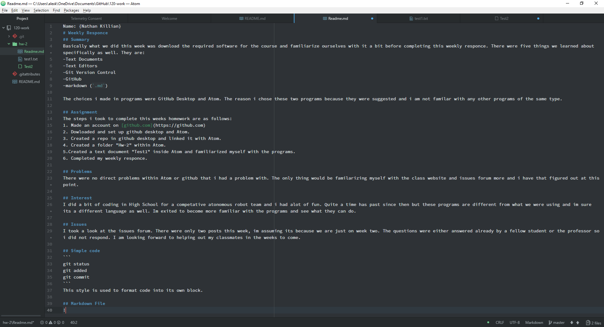

Name: {Nathan Killian}
# Weekly Responce
## Summary
Basically what we did this week was download the required software for the course and familiarize ourselves with it a bit before completing this weekly responce. There were five things we learned about specifically as well. They are:
-Text Documents
-Text Editors
-Git Version Control
-GitHub
-markdown (`.md`)

The choices i made in programs were GitHub Desktop and Atom. The reason i chose these two programs because they were suggested and i am not familar with any other programs of the same type.

## Assignment
The steps i took to complete this weeks homework are as follows:
1. Made an account on [github.com](https://github.com)
2. Dowloaded and set up github desktop and Atom.
3. Created a repo in github desktop and linked it with Atom.
4. Created a folder "Hw-2" within Atom.
5.Created a text document "Test1" inside Atom and familiarized myself with the programs.
6. Completed my weekly responce.

## Problems
There were no direct problems within Atom or github that i had a problem with. The only thing would be familarizing myself with the class website and issues forum more and i have that figured out at this point.

## Interest
I did a bit of coding in High School for a competative atonomous robot team and i had alot of fun. Quite a time has past since then but these programs are different from what we were using and im sure its a different language as well. Im exited to become more familiar with the programs and see what they can do.

## Issues
I took a look at the issues forum. There were only two posts this week, im assuming its because we are just on week two. The questions were either answered already by a fellow student or the professor so i did not respond. I am looking forward to helping out my classmates in the weeks to come.

## Simple code
```
git status
git added
git commit
```
This is used to format code into its own block.

## Markdown File

